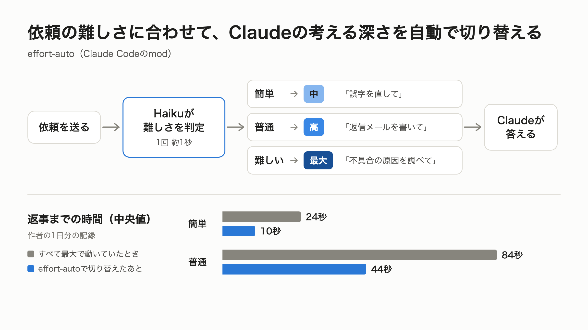
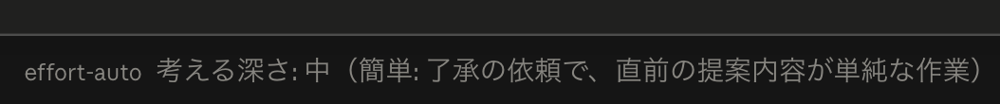

# effort-auto

Claude Codeは、どの依頼も同じ「考える深さ」の設定で動く作りです。
誤字を1か所直すだけの依頼でも、設計を決める依頼と同じ設定なので、必要以上に考えて返事が遅くなることがあります。

effort-autoは、依頼を送るたびにHaiku（軽くて安いモデル）が依頼の難しさを判定し、Claudeの**考える深さ**（effort）をその依頼に合わせて切り替えます。



| 判定 | 考える深さ | 当てはまる依頼の例 |
|---|---|---|
| 簡単 | 中 | 一言で答えられる質問、誤字の修正、ファイルを開くだけの依頼 |
| 普通 | 高 | メールや資料の文章、調べもの、アイデア出しや相談 |
| 難しい | 最大 | 企画や設計の全体、原因の調査、数字の集計、本番環境やお金や顧客データが関わる作業 |

作者の1日分の記録では、速くなり、トークンも減りました（どちらも中央値）。

| 判定 | 返事までの時間 | 考えるのに使うトークン |
|---|---|---|
| 簡単 | 24秒から10秒に | 695から234に |
| 普通 | 84秒から44秒に | 3,664から867に |

深さを下げた92回分では、使った量全体が2〜3割ほど減った見込みです。
判定は1回1秒ほどです。
Haikuが使うトークンは1回あたり入力1,000前後（長い依頼では3,000ほど）、出力20〜30で、本体の作業に比べてわずかです。

## 入れ方

### ターミナルで使っている場合

Claude Codeの入力欄で次の1行を実行します。

```
/plugin install effort-auto --marketplace k-hide10/claude-code-plugins
```

シェルから入れる場合は次の2行です。

```
claude plugin marketplace add k-hide10/claude-code-plugins
claude plugin install effort-auto@hide10
```

### デスクトップアプリで使っている場合

デスクトップアプリで`/plugin`と打つと設定の「プラグイン」画面が開きますが、この画面からは入れられません。
代わりに、新しいセッションでClaudeに次の文を送ってください。
`claude`コマンドを入れていなくても、デスクトップアプリに入っているClaude Codeを使って入れられます（Macで確認済み）。

```
Claude Code のプラグイン effort-auto を入れたいです。次のとおり進めて。
1. claude コマンドがあればそれを使う。なければ、デスクトップアプリに入っている Claude Code を使う
   （~/Library/Application Support/Claude/claude-code/ の中の claude.app/Contents/MacOS/claude で、一番新しい版のもの）
2. その claude で、次の 2 つを順に実行する
   plugin marketplace add k-hide10/claude-code-plugins
   plugin install effort-auto@hide10
3. plugin list で effort-auto@hide10 が入ったか確かめて、結果を教えて
```

実行してよいか聞かれたら、許可してください。

どちらの場合も、入れたあとに始めたセッションから動きます。

## 使い方

ふだんどおりに依頼を送るだけです。
判定の結果は、入力欄の下に次のように表示されます。



返答が終わると、かかった時間も足されます。

```
考える深さ: 中（簡単: 誤字の修正）
考える深さ: 中（簡単: 誤字の修正）・12秒で回答
```

依頼の頭に言葉を付けると、判定を待たずに深さを決められます。

- 「さっと」で始める：中
- 「じっくり」で始める：最大

| コマンド | すること |
|---|---|
| `/effort-auto` | 直近10件の判定を見る |
| `/effort-auto off` | 自動の切り替えを止める |
| `/effort-auto on` | 自動の切り替えを再開する |

## 深さを変えない場合

次の場合は判定せず、いつもの深さ（Claude Codeの設定）のまま動きます。

- 対象外のモデルを使っているとき（下の「動く条件」を参照）
- `/` で始まるスラッシュコマンド、バックグラウンド作業の完了通知、ほかのセッションからの連絡、定期実行など、人が打った依頼ではないもの
- Haikuから5秒以内に答えが返らないなど、判定できなかったとき
- Claudeの作業中に送った依頼（動いている作業の途中では深さを変えられないため）

アプリを開き直したときに自動で送られる続きの依頼や「もう一度試す」は判定せず、直前の判定をそのまま使います。
サブエージェントの深さは変えません。

## 深さの上げ下げについて

判定に合わせて、いつもの深さより下げることも、上げることもあります。
いつもの深さを中や低にして節約している人は、難しい依頼で最大まで上がるぶん、消費が増えることがあります。

## 判定の精度

判定の基準は、日本語の業務（企画、資料、文章、データ分析）と開発の依頼で調整しました。
職種の違う40件の依頼（エンジニア、デザイナー、営業、問い合わせ対応、人事、経理、マーケティング）を、1件につき3回ずつ判定させたところ、39件が3回とも想定どおりでした。
外れた1件（作ったメールの送信を了承する返事）も、想定より深く考える側の外れです。
難しい依頼を「簡単」と見誤ったものはありませんでした。
ずれに気づいたら、GitHubのIssuesで教えてください。

## 動く条件

- Claude Code 2.1.287以上（modが使える版）
- メインのモデルがOpus 5.5、Sonnet 5.5、Fable 5.1のいずれかで、サブスクリプションかAPIキーで使っていること

この条件にしているのは、キャッシュ（前回までのやり取りの使い回し）のためです。
公式ドキュメントによると、上のモデル以外では深さを変えるたびにキャッシュが作り直しになり、長い会話ではかえって高くつきます。
そのため、上のモデル以外では深さを変えません。
Amazon Bedrock、Google Cloud、Microsoft Foundry、Anthropic以外のゲートウェイを経由する設定が入っているときは、上のモデルでもキャッシュが作り直しになるので、判定も切り替えもしません（入力欄の下に「この接続方法は対象外」と出ます）。
組織でHIPAAの設定をしている場合も同じですが、mod側では見分けられないので入れないでください。

## 判定の記録

判定ごとに、`~/.claude/mod-data/effort-auto.jsonl` に1行ずつ記録します。
中身は、依頼の先頭60字、判定、理由、考える深さ、かかった秒数、使ったトークン数です。
記録はこのファイルにだけ書き、ほかへは送りません。
判定のために、依頼文（2,000字を超える場合は頭の1,200字と終わりの800字）と直前のClaudeの返答（最後の1,200字）をHaikuに渡します。
これはClaude Codeのふだんのやり取りと同じく、自分のアカウントでAnthropicに送られます。

## 気をつけること

modは、使う人のパソコンの上で、その人と同じ権限で動きます。
入れる前に、`claude plugin validate` で何をするmodなのかを確認できます。

```
claude plugin validate .
```

